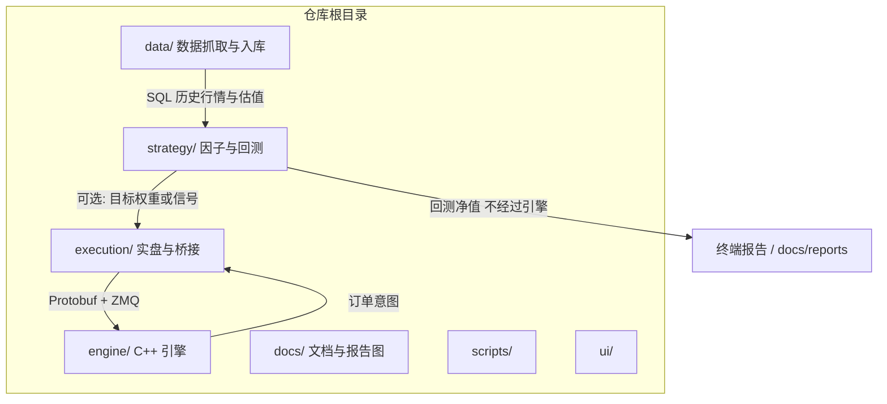

# A 股量化交易系统

个人量化工程：**Python 数据与策略研究** + **C++ 执行引擎** + **Python 实盘桥接（QMT 等）**。目标是在可控复杂度下形成可复现的研究—回测—信号—执行闭环。

---

## 目录与职责

| 路径 | 说明 |
|------|------|
| `data/` | 配置、Tushare 拉取、ClickHouse / PostgreSQL 写入与运维脚本 |
| `strategy/` | 回测指标、可视化、示例策略（多因子 v4、反转价值等） |
| `engine/` | C++17 交易引擎：Protobuf 信号、OMS、ZMQ 等（CMake + Conan） |
| `execution/` | 实盘侧：风控、组合、QMT 适配、ZMQ 桥、运行入口 |
| `docs/reports/` | 回测生成的图表（如 `multifactor_v4.png`） |

---

## 项目结构图

下列为**主要源码与配置目录**；未列出 `.git`、`.venv`、`__pycache__`、`engine/build`、本地 Conan 缓存等生成物。

### 目录树（摘要）

```text
quantitative_trading_projects/
├── README.md
├── requirements.txt
├── .env                          # 本地：库连接、Token（勿提交仓库）
│
├── data/                         # 数据层（抓取、清洗、入库、配置）
│   ├── config/                   # settings.yaml, sources.yaml, schedules.yaml
│   ├── common/                   # 公共配置加载等
│   ├── fetchers/                 # Tushare 等拉取
│   ├── writers/                  # ClickHouse / PostgreSQL 写入
│   ├── pipeline/                 # 流水线编排
│   ├── cleaners/                 # 清洗
│   └── quality/                  # 质量检查
│
├── strategy/                     # 策略研究 / 回测
│   ├── backtest/                 # metrics, visualizer
│   ├── examples/                 # regime_switching_strategy, reversal_value_strategy, …
│   ├── factors/
│   ├── signals/
│   └── analysis/
│
├── engine/                       # C++ 执行引擎
│   ├── CMakeLists.txt
│   ├── conanfile.txt             # Conan 依赖（若使用）
│   ├── proto/                    # signal.proto 等
│   ├── include/quant/            # 头文件（infra, oms, risk, …）
│   ├── src/                      # main, gateway, oms, …
│   ├── python/                   # 生成或辅助的 Python（如 *_pb2）
│   ├── config/                   # engine.yaml
│   ├── tests/
│   └── benchmarks/
│
├── execution/                    # 实盘桥接与风控（Python）
│   ├── adapter/                  # qmt_adapter 等
│   ├── bridge/                   # 与引擎 ZMQ / 信号对接
│   ├── risk/                     # pre_trade 等
│   ├── portfolio/
│   ├── oms/
│   ├── algo/                     # TWAP 等
│   ├── persist/                  # 落库
│   ├── monitor/
│   ├── gateway/
│   ├── broker/
│   ├── examples/
│   ├── config.yaml
│   └── run.py                    # 运行入口之一
│
├── docs/                         # 文档与产出
│   ├── reports/                  # 回测图（如 multifactor_v4.png）
│   ├── architecture/             # 分层说明（若保留）
│   ├── cpp-design/
│   ├── phases/
│   ├── research/
│   └── ops/
│
├── scripts/                      # 运维 / 一次性脚本
└── ui/                           # Streamlit 轻量台 + 机构级 React 控制台 + FastAPI
```

### 结构关系（Mermaid）



---

## 系统架构（与仓库对应）

```
                    ┌─────────────────────────────────────┐
                    │  外部：Tushare / 券商 QMT (xtquant)   │
                    └─────────────────┬───────────────────┘
                                      │
┌─────────────────────────────────────▼─────────────────────────────────────┐
│ 数据层 (Python)                                                            │
│  ClickHouse: stock_daily, index_daily                                     │
│  PostgreSQL: daily_valuation, stock_info, trade_calendar, …               │
│  配置: data/config/settings.yaml, sources.yaml                             │
└─────────────────────────────────────┬─────────────────────────────────────┘
                                      │ SQL 读取
┌─────────────────────────────────────▼─────────────────────────────────────┐
│ 策略研究层 (Python)                                                         │
│  示例: strategy/examples/regime_switching_strategy.py（多因子 v4 + 止损）    │
│        strategy/examples/reversal_value_strategy.py                        │
│  工具: strategy/backtest/metrics.py, visualizer.py                         │
└─────────────────────────────────────┬─────────────────────────────────────┘
                        回测净值 / 年度收益              Protobuf / ZMQ
                                      │                            │
                    （不经过 C++）     │                            ▼
                                      │          ┌─────────────────────────────────┐
                                      │          │ C++ 执行引擎 (engine/)            │
                                      │          │  信号接收 · 风控 · OMS · 网关桩   │
                                      │          └─────────────────┬───────────────┘
                                      │                            │
                                      │          ┌─────────────────▼───────────────┐
                                      │          │ execution/：QMT 适配、桥接、风控   │
                                      └──────────┤  pre_trade、position 等         │
                                                 └─────────────────────────────────┘
```

**研究与实盘分工**

- **回测**：在历史行情与估值上重算信号与权重，用日收益与换手估计成本与净值；**不启动** C++ 进程，也**不模拟**交易所撮合、滑点微观结构、涨跌停排队等（除非你在策略里显式建模）。
- **实盘**：策略侧（Python）产生目标权重或订单意图 → **Protobuf + ZMQ**（或项目内桥接模块）→ C++ 引擎 / QMT 适配器 → 券商。

---

## 多因子策略 v4 / v4.1（当前主示例）

**文件**：`strategy/examples/regime_switching_strategy.py`

**思路**：截面多因子打分 + 季度调仓 + 惯性保留部分老仓 + **名义杠杆**（权重缩放）+ **组合净值回撤止损** + **CSI300 双均线重入**。

**v4.1 策略层（趋势牛增厚，无前瞻）**

- **趋势牛**（用于当日决策）：前一交易日 CSI300 **昨收 > 昨 MA60** 且 **昨 MA20 > 昨 MA60**。
- 牛市：**有效杠杆** ≈ `LEVERAGE × REGIME_LEV_MULT`；组合止损阈值用 **STOP_LOSS_BULL**（宽于非牛 **STOP_LOSS**）。
- 牛市：因子侧 **MOM120 权重上调、RET60/MA60 下调**（按行重新归一化）。

**因子基线权重（合计 1.0，截面 rank 后加权；牛市在上述范围内动态倾斜）**

| 因子 | 权重 | 含义（高分 = 更想持有） |
|------|------|-------------------------|
| MA60 | 0.20 | 价格相对 60 日均线偏低（均值回复） |
| RSI | 0.07 | RSI 低（超卖） |
| RET60 | 0.05 | 60 日收益率低（中期反转） |
| MOM120 | 0.32 | 120 日收益率高（中期动量/复苏） |
| PB | 0.16 | 市净率低 |
| SIZE | 0.08 | 流通市值小 |
| EP | 0.12 | 盈利收益率 1/PE（剔除异常 PE） |

**股票池（与回测数据一致）**

- 至少 60 日上市、非 ST/退市、20 日均成交额 ≥ 1 亿（千元口径 `MIN_AMOUNT=100_000`）
- 相对 52 周高：`close/252d_max >= 0.30`（过滤过度深跌）
- 波动率：剔除截面 20 日波动率最高的约 30%（`VOL_CUTOFF=0.70`）

**组合**

- `TOP_N=30`，`REBAL_FREQ≈50`（交易日），`INERTIA≈0.24`（上期持仓在调仓日加分）
- `LEVERAGE≈2.22`，牛市再乘 `REGIME_LEV_MULT≈1.14`（回测名义杠杆；实盘请与融资能力一致）
- 成本：`BUY_COST_BPS=7.5`，`SELL_COST_BPS=17.5`（按换手估算）

**组合层止损（后处理净值序列）**

- 非牛：自高点回撤超过 `STOP_LOSS≈17%` 触发清仓逻辑；牛：`STOP_LOSS_BULL≈27%`（见代码常量）。
- 重入：空仓满 `STOP_COOLDOWN=63` 日强制恢复，或满 10 日且 **昨收 CSI300 同时高于 20 日与 60 日均线**（信号均用前一日，避免前视）

### v4 回测结果快照（示例跑批，非承诺收益）

以下为 **v4.0 参数** 下一次完整跑批的**存档对照**；当前仓库默认已为 **v4.1**（趋势牛增厚），**请本地重跑** `regime_switching_strategy.py` 更新数字。区间 **2010-01-04～2026-03-20**，数据为本地 ClickHouse/PostgreSQL。

**全样本（约 15.6 年，3935 交易日）**

| 指标 | 数值 |
|------|------|
| 总收益率 | **+8469.65%** |
| 年化收益率 | **32.98%** |
| 年化波动率 | 31.67% |
| 夏普比率 | 0.981 |
| 卡玛比率 | 0.788 |
| Sortino | 1.369 |
| 最大回撤 | **-41.82%** |
| 最大回撤持续 | 249 交易日 |
| 日胜率 | 34.76% |
| 盈亏比 | 1.069 |
| 年化换手率 | 578.1% |
| 累计交易成本（估算） | 13.54% |

**分年收益与年内最大回撤**

| 年份 | 年度收益 | 年内回撤 |
|------|----------|----------|
| 2010 | +35.5% | -14.5% |
| 2011 | -18.9% | -31.4% |
| 2012 | +17.8% | -23.2% |
| 2013 | -10.8% | -25.9% |
| 2014 | +98.8% | -13.6% |
| 2015 | +308.2% | -14.2% |
| 2016 | +18.4% | -15.3% |
| 2017 | +11.4% | -15.1% |
| 2018 | -28.3% | -39.0% |
| 2019 | +64.5% | -22.9% |
| 2020 | +7.5% | -23.2% |
| 2021 | +97.0% | -19.8% |
| 2022 | +16.9% | -14.9% |
| 2023 | +4.7% | -21.6% |
| 2024 | +57.7% | -18.2% |
| 2025 | +24.9% | -12.9% |
| 2026（至 03-20） | +15.1% | -12.0% |

**参数实验备忘（同一框架下曾显著变差，改参请小步验证）**

- 对全日收益做 **指数低于 MA120 时的收益缩放**、**过度收紧** `VOL_CUTOFF` / `FALLEN_KNIFE`、**名义杠杆 2.0→~1.85** 等，曾拉低长周期收益或拖累单年（如 2024）；勿假定「更保守」一定改善净值。

---

## 回测说明

**前置条件**

1. Python 3.10+，建议虚拟环境：`python3 -m venv .venv && source .venv/bin/activate`（Debian/Ubuntu 通常无 `python` 命令，需 `python3` 或安装 `python-is-python3`）
2. 安装依赖：`pip install -r requirements.txt`（未激活 venv 时可用 `python3 -m pip install -r requirements.txt`）
3. 数据库：ClickHouse、PostgreSQL 按项目 `data/` 侧配置启动，`.env` 或 `data/config/settings.yaml` 中填写连接信息（与 `ClickHouseWriter` / `PostgresWriter` 一致）
4. 库内已有与策略区间匹配的 **日线行情、指数、日度估值** 等表数据（由 Tushare 拉取脚本写入）

**运行示例**

```bash
# 任选其一（推荐用 venv 里的解释器，不依赖系统是否提供 python 别名）
python3 strategy/examples/regime_switching_strategy.py
# 或: .venv/bin/python strategy/examples/regime_switching_strategy.py
```

**整手真实回测（`regime_switching_lot_20k.py`）**  
默认 **只输出** 指定本金下的 **100 股整手 + 最低佣 + 增量调仓** 账户权益曲线（与主脚本同信号、动态杠杆、模型止损日历）。小资金按 `lot_effective_top_n()` **自动收窄 TOP_N**（同一套截面信号下少持几只、避免一手都买不起的欠配）；主脚本理想回测仍为 **TOP_N=30**。`--show-model` 打印 **30 只** 小数权重模型百分比，便于对照。

```bash
python3 strategy/examples/regime_switching_lot_20k.py
python3 strategy/examples/regime_switching_lot_20k.py --capital 100000
python3 strategy/examples/regime_switching_lot_20k.py --show-model
```

**输出**

- 终端：全样本指标、**分年收益与年内最大回撤**、成本粗算（与上文 **v4 回测结果快照** 一致的前提是数据与代码参数未改）
- 图表：`docs/reports/multifactor_v4.png`（若路径不存在可先创建 `docs/reports/`）

**指标理解**

- **年化收益率**：按回测区间长度复利折算，不是「每一年都达到该数字」
- **年度收益**：日历年内日收益连乘，便于看单年好坏
- 回测为 **理想化成交**（收盘价、无涨跌停不可成交、无盘中熔断等），实盘需打折评估

---

## 机构级运维控制台（React + FastAPI）

与 `./ops.sh` 同源：REST 触发 `status` / `start-db` / `daily` 等；后台回填与日志路径与 `ui/ops_dashboard.py` 一致。适合内网部署、权限收口与 **WebSocket 实时日志**。

**依赖**：`pip install -r requirements.txt`；前端需 **Node 18+**（`npm`）。

**开发（双进程）**

1. 启动 API（仓库根目录）：

   ```bash
   ./ops.sh web-pro 8787
   # 等价: PYTHONPATH=. .venv/bin/python -m uvicorn ui.server.app:app --host 127.0.0.1 --port 8787
   ```

2. 启动前端（新终端）：

   ```bash
   cd ui/ops-console && npm install && npm run dev
   ```

   浏览器打开 `http://127.0.0.1:5173`（Vite 将 `/api` 与 WebSocket 代理到 `8787`）。

**生产（单端口）**：先在 `ui/ops-console` 执行 `npm run build`，再只运行 `./ops.sh web-pro`；构建产物 `dist/` 由 FastAPI 挂载在站点根路径 `/`，API 仍在 `/api/*`。

**可选鉴权**：设置环境变量 `QUANT_OPS_API_KEY` 后，除 `GET /api/health`、`GET /api/meta` 外，REST 需请求头 `X-API-Key`；日志 WebSocket 使用查询参数 `token`（与密钥相同）。前端侧栏 **连接与凭据** 可写入浏览器 `localStorage`。

**CORS**：默认允许本机 `5173` / `8787`；其他来源可设 `QUANT_OPS_CORS`（逗号分隔 Origin）。

**可观测与排障（与控制台页脚一致）**：每个 HTTP 响应带 `X-Request-ID`（可客户端传入同名请求头，否则服务端生成 UUID）与 `X-Server-Time`（UTC）；访问日志写入 logger `quant.ops.http`。`GET /api/health` 与 `GET /api/meta` 的 JSON 中含 `server_time_utc`；可选环境变量 `QUANT_OPS_BUILD_ID`（如 git SHA）会出现在 health/meta 与总览「构建标识」中。

**单股 K 线与简易回测**（Web 侧栏「单股研究」）：依赖已回填的 ClickHouse `stock_daily` 与 PostgreSQL `stock_info`。主要接口（均需 `X-API-Key`，若已启用鉴权）：

- `GET /api/research/stocks?q=`：按代码/名称模糊搜索；
- `POST /api/research/single-stock-run`：请求体含 `ts_code`、`start`/`end`（YYYYMMDD）、`strategy`（`ma_cross` | `buy_hold`）及均线参数，返回 K 线序列与净值曲线数据；
- `POST /api/research/regime-model-run`：请求体 `ts_code`、`start`、`end`，在服务端执行与 `strategy/examples/regime_switching_strategy.py` **同一套 v4.1** 因子、TOP_N、杠杆、成本与组合止损（全市场按年加载），返回组合净值、该标的买入持有净值、该标的日度权重及 K 线；**可能较慢且占内存**；
- `GET /api/research/bars`：仅拉取 OHLCV。

**轻量 Streamlit 台**：`./ops.sh web` 仍为 `ui/ops_dashboard.py`。

---

## 执行层与 QMT（简表）

| 组件 | 作用 |
|------|------|
| `engine/` | C++ 引擎：接收信号、订单与风控管线（详见 `engine/src`、`engine/include`） |
| `engine/proto/signal.proto` | 与 Python 共用的信号消息定义 |
| `execution/adapter/qmt_adapter.py` | 与 miniQMT / xtquant 方向的适配说明与 ZMQ 端点约定 |
| `execution/bridge/strategy_bridge.py` | 策略侧与引擎之间的桥接示例 |
| `execution/risk/pre_trade.py` | 盘前/下单前风控示例 |

具体端点以 `execution/config.yaml`、`engine/config/engine.yaml` 为准。

---

## C++ 引擎构建（摘要）

```bash
cd engine
# 按项目既有 Conan/CMake 流程配置（见 engine 目录内 CMakeLists.txt）
mkdir -p build && cd build
cmake .. -DCMAKE_BUILD_TYPE=Release
cmake --build . -j"$(nproc)"
```

---

## 设计原则（保留）

1. **研究与执行分离**：研究在 Python；低延迟与下单在 C++；边界用明确消息格式（如 Protobuf）。
2. **回测不等于实盘**：回测验证逻辑与粗量级；实盘需接真实行情、费用与风控。
3. **风控多层**：信号层约束 + OMS/适配器层 + 券商端。
4. **渐进演进**：先跑通数据与回测，再接信号与模拟盘，最后小资金实盘。

---

## 免责声明

策略与参数仅供研究与学习；历史回测表现不构成未来收益承诺。投资有风险。
