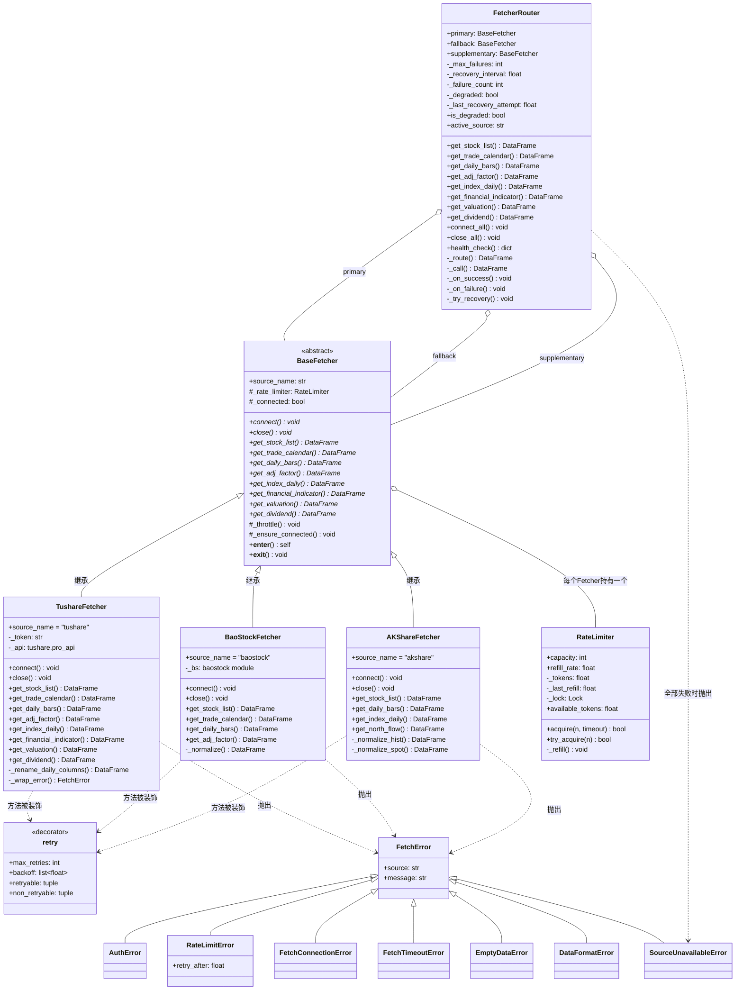

# 数据获取层 — 类图设计

## 一、整体类图（Mermaid）



## 二、设计模式说明

### 1. 模板方法模式 — BaseFetcher

```
BaseFetcher（抽象基类）定义了算法骨架:

    每个 get_xxx() 方法的执行流程:
    ┌──────────────────────────┐
    │ _ensure_connected()      │  ← BaseFetcher 提供
    │ _throttle()              │  ← BaseFetcher 提供（调用 RateLimiter）
    │ 子类具体实现 API 调用      │  ← 子类重写
    │ 子类数据标准化            │  ← 子类重写
    └──────────────────────────┘
```

### 2. 策略模式 — 三个 Fetcher 实现

```
同一接口，不同实现:

    get_daily_bars("000001.SZ", "20260227")
    │
    ├── TushareFetcher:  api.daily(ts_code="000001.SZ", trade_date="20260227")
    │                    → 一次返回全市场数据（5000+条）
    │
    ├── BaoStockFetcher: bs.query_history_k_data_plus(code="sz.000001", ...)
    │                    → 逐只股票查询
    │
    └── AKShareFetcher:  ak.stock_zh_a_hist(symbol="000001", ...)
                         → 逐只股票查询
```

### 3. 组合 + 代理模式 — FetcherRouter

```
FetcherRouter 持有三个 Fetcher 实例，
对外暴露同一套接口，内部决定路由到哪个数据源:

    调用方                    FetcherRouter                    数据源
    ──────                   ─────────────                   ──────
      │                           │                            │
      │  get_daily_bars()         │                            │
      │ ─────────────────>        │                            │
      │                           │  _route("get_daily_bars")  │
      │                           │  ┌──────────────────────┐  │
      │                           │  │ 未降级? 尝试 primary  │──│──> Tushare
      │                           │  │ 失败? failure_count++ │  │
      │                           │  │ ≥3次? 进入降级模式     │  │
      │                           │  │ 降级? 尝试 fallback   │──│──> BaoStock
      │                           │  │ 每300s探测恢复        │  │
      │                           │  └──────────────────────┘  │
      │  <─────────────────       │                            │
      │    DataFrame              │                            │
```

### 4. 装饰器模式 — @retry

```
@retry(max_retries=3, backoff=[1, 2, 4])
def get_daily_bars(self, ...):
    ...

等价于:
    get_daily_bars = retry(max_retries=3, backoff=[1,2,4])(get_daily_bars)

执行时:
    ┌─── retry wrapper ────────────────────────────┐
    │ attempt 0: 调用原始函数                        │
    │   ├── 成功 → 返回结果                          │
    │   ├── AuthError → 直接抛出（不可重试）           │
    │   └── ConnectionError → 等1秒                 │
    │ attempt 1: 再调一次                            │
    │   └── 又失败 → 等2秒                           │
    │ attempt 2: 最后一次                            │
    │   └── 还失败 → 等4秒                           │
    │ attempt 3: 超出次数 → 抛出最后一次的异常          │
    └──────────────────────────────────────────────┘
```

### 5. 令牌桶模式 — RateLimiter

```
    桶容量: 10 个令牌           补充速率: 3个/秒
    ┌──────────────┐
    │ 🪙🪙🪙🪙🪙🪙🪙 │   ← 初始满桶 (10个)
    └──────┬───────┘
           │
    API调用1: acquire() → 取1个 → 剩9个 → 立即通过
    API调用2: acquire() → 取1个 → 剩8个 → 立即通过
    ...
    API调用10: acquire() → 取1个 → 剩0个 → 立即通过
    API调用11: acquire() → 桶空! → 阻塞等待 0.33秒 → 补充1个 → 通过
```

## 三、各 Fetcher 能力对比

| 接口 | Tushare | BaoStock | AKShare |
|------|---------|----------|---------|
| get_stock_list | ✅ 全量 | ✅ 全量 | ✅ 基础 |
| get_trade_calendar | ✅ | ✅ | ❌ |
| get_daily_bars | ✅ 按日全市场 | ✅ 逐只股票 | ✅ 逐只股票 |
| get_adj_factor | ✅ 直接提供 | ✅ 推算(两次请求) | ❌ |
| get_index_daily | ✅ | ❌ | ✅ |
| get_financial_indicator | ✅ | ❌ | ❌ |
| get_valuation | ✅ | ❌ | ❌ |
| get_dividend | ✅ | ❌ | ❌ |
| 北向资金 | ❌ | ❌ | ✅ 独有 |
| **需要Token** | ✅ (2000积分) | ❌ 免费 | ❌ 免费 |
| **限速** | 200次/分 | 较宽松 | 无官方限制 |

## 四、代码格式转换

三个数据源的股票代码格式各不相同，Fetcher 内部负责转换:

```
系统内部标准:  000001.SZ    (Tushare 格式)
                ↕
BaoStock:     sz.000001    (_ts_code_to_baostock / _baostock_to_ts_code)
AKShare:      000001       (纯数字 + _to_ts_code 推断交易所)
```

日期格式同样统一:

```
系统内部标准:  20260227     (纯数字字符串)
                ↕
BaoStock:     2026-02-27   (_to_baostock_date)
AKShare:      2026-02-27   (pandas 自动处理)
```
